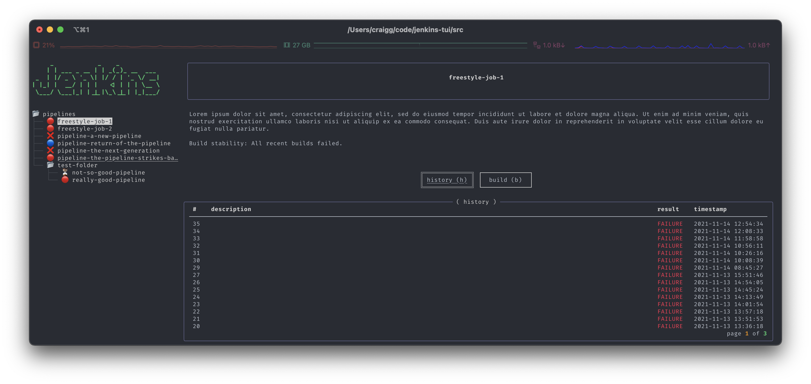

# jenkins-tui :package:

 [](https://badge.fury.io/py/jenkins-tui)

`jenkins-tui` is a terminal based user interface for Jenkins.

> :construction: :warning: This app is a prototype and in very early stages of development. There will be bugs, bad UX and missing functionality.


:rocket: This project is powered by [textual](https://github.com/willmcgugan/textual) and [rich](https://github.com/willmcgugan/rich)!

## Installing with pip

```bash
pip install jenkins-tui
```

## Configure

The app stores the sensitive stuff at `~/.jenkins-tui.toml`. You can create it manually using the schema below or let the app do it for you on first run.

```bash
# .jenkins-tui.toml

url = ""
username = ""
password = ""
```

## Run

```bash
jenkins
```

## Run with Docker

You can also run the app with docker:

```bash
run --rm -it --volume $HOME:/root ghcr.io/chelnak/jenkins-tui:latest --host github.com
```

## Screenshots

### Build history



### Build with parameters


## Developing

### Install dependencies

Install dependencies with poetry:

```bash
poetry install
```

### Building

To keep local builds consistent with ci, use make to build and lint:

```bash
make build
```

### Install pre commit hooks

The project uses [pre-commit](https://pre-commit.com/) for commit time checking. You can find the configuration [here](.pre-commit-config.json).

```bash
pre-commit install
```

### Starting the dev environment

The dev environment gives you a fully configured dev instance. To start it run the following command:

```bash
make dev-run
```

Once it's started you can access it locally with the following details:

| host | user | password |
|------|------|----------|
| <http://localhost:8080> | admin | admin |

You can also start an instance of jenkins-tui that is configured to talk to the local jenkins instance with:

```bash
make run
```

> The dev env set up uses lots of the good stuff from this repository: <https://github.com/uhafner/warnings-ng-plugin-devenv/tree/main/docker> :rocket:

### Releasing stuff

Releasing is a semi manual but well oiled method. Tags are used to trigger the release steps in the ci process.

Running the following make command will tag and push the latest commit triggering a release.

```bash
make tag version="v0.0.5"
```

> Note: Releases can only be generated from the main branch.

### Runing locally

You can either build a new package using `make build` and install it or run the package directly:

```bash
cd src
python -m jenkins_tui.app
```

### Compatibility

This project has been tested on macOS and Linux (Arch, Ubuntu 20.04 and above) with Python 3.9 installed. It will likely work on any Linux distribution where Python 3.9 or above is available.
For Ubuntu 20.04, it may be necessary to install the `python3.9` package.
